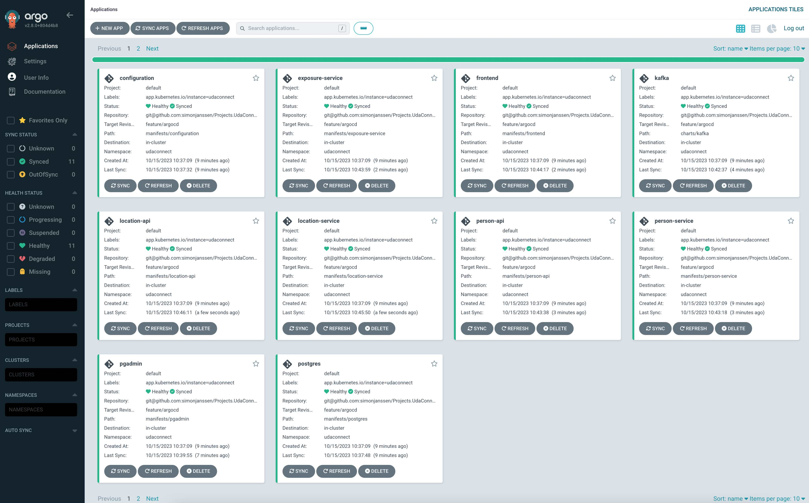
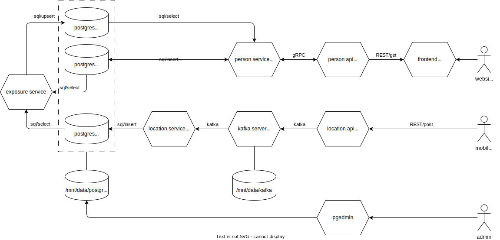
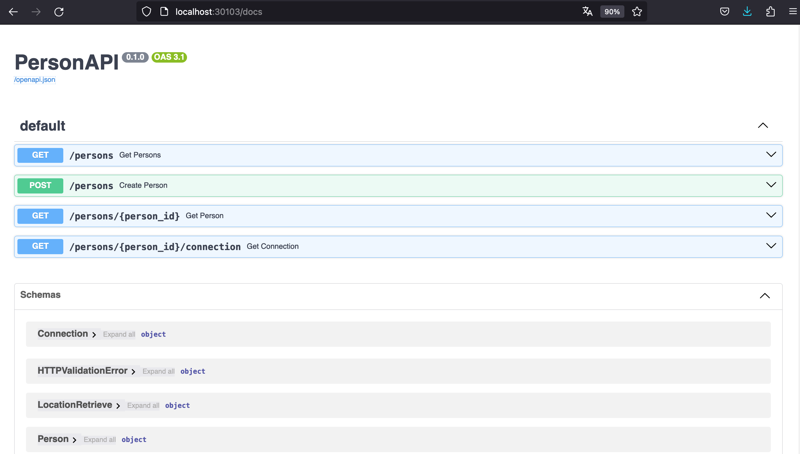

# Projects.UdaConnect

## About

This is the repository for submitting the project for course 2. The `v*_project-submission` releases are the intended code versions for submission. Please choose the latest one.


### Third-Party Code
This project is based on the starter project provided at [https://github.com/udacity/nd064-c2-message-passing-projects-starter](https://github.com/udacity/nd064-c2-message-passing-projects-starter). From this, the following code has been copied / modified:
- frontend application ([applications/udaconnect-ms-frontend](applications/udaconnect-ms-frontend)): minor modifications in `Dockerfile` and `Connection.js` and `Person.js` API URLs. Otherwise unchanged.
- database models for sqlalchemy ([build/types/models.py](build/types/models.py)) with major modifications for refactoring

The Kafka Helm Charts to deploy the Kafka server have been copied unchanged from [https://github.com/bitnami/charts/tree/main/bitnami/kafka](https://github.com/bitnami/charts/tree/main/bitnami/kafka) (licenced unde the [Apache License 2.0](https://www.apache.org/licenses/LICENSE-2.0)) except for some minor modifications in the [values file](charts/kafka/values.yaml). 


## Repository Structure

- [applications](applications): source code for all refactored custom microservices
- [build/types](build/types): common models, schemas and proto files shared with all applications. These files are copied within the ci-workflow to avoid duplicates and allow central management of all message definitions.
- [.github/workflows/app-build.yaml](.github/workflows/app-build.yaml): github ci-workflow to build and push applications to docker hub registry [hub.docker.com/u/simonshub](https://hub.docker.com/u/simonshub)
- [argocd](argocd): argocd application config files. Follows the `app of apps` schema.
- [charts](charts): helm charts for Kafka (copied from [bitnami/kafka](https://github.com/bitnami/charts/tree/main/bitnami/kafka))
- [manifests](manifests): kubernetes declarative deployment manifests for all other applications
- [docs](docs): additional documentation required for project submission


## How To Run This Project

Assuming you have kubernetes, kubectl and argocd ready:

1. Configure volumes on host: [pgadmin](https://www.pgadmin.org/docs/pgadmin4/latest/container_deployment.html#mapped-files-and-directories) and [kafka](https://github.com/bitnami/containers/blob/main/bitnami/kafka/README.md#persisting-your-data) need specific user ids on host to access mounted volumes from their containers.

```bash
mkdir -p /mnt/data/postgres
mkdir -p /mnt/data/pgadmin
mkdir -p /mnt/data/kafka
chown -R 5050:5050 /mnt/data/pgadmin
chown -R 1001:1001 /mnt/data/kafka 
```

2. Deploy with ArgoCD:
```bash
kubectl apply -f argocd/udaconnect.yaml
```

3. Sync applications: 
    - For this project, auto-sync is not enabled so you need to sync the apps manually.
    - The ArgoCD setup follows the [App of Apps Pattern](https://argo-cd.readthedocs.io/en/stable/operator-manual/cluster-bootstrapping/). The **udaconnect** app acts as the parent app that needs to be synced first.
    - You can then sync all the other apps. I would recommend to sync **configuration**, **postgres** and **kafka** apps first as the other apps depend on them.




4. Available endpoints after cluster startup:
    - The following endpoints are externally available on your host system:
        - [localhost:30100](http://localhost:30100): pgAdmin Frontend
        - [localhost:30101](http://localhost:30101): Udaconnect Frontend
        - [localhost:30102](http://localhost:30102): LocationAPI
        - [localhost:30103](http://localhost:30103): PersonAPI
    - The following endpoints are cluster-internal only:
        - [postgres-svc:5432](tcp://postgres-svc:5432): PostgreSQL database
        - [kafka:9092](tcp://kafka:9092): Kafka server
        - [person-service-svc:5005](tcp://person-service-svc:5005): gRPC server

5. Generate some data:
    - Generate some mock persons using the **PersonAPI** endpoint (cf. [postman collection](docs/postman.json)). The interactive SwaggerUI provides you with some mock data you can directly `post`. I would recommend to add at least two different persons.
    - Generate some mock location data using the **LocationAPI** endpoint (cf. [postman collection](docs/postman.json)). Again, you can use the interactive SwaggerUI to `post` some data. Alternatively, you can start mock clients that generate some random location data for particular `persons`:
```bash
python applications/udaconnect-test-clients/client.py -i PERSON_ID
```

Note that due to the async database update (`location-service`) and the async connections calculation (`exposure-service`) it may take two or three minutes until you see the data in the **frontend**.

The deployment has been tested with [k3s](https://k3s.io/) and [ArgoCD v2.8.0](https://argo-cd.readthedocs.io/en/stable/) using an [Ubuntu 22.04.3 LTS Server](https://ubuntu.com/download/server) environment.


## Architecture

Major architecture design decisions:
- In the given starter setup, both person and location endpoints were merged into one central API. The business requirements state, however, that the location endpoint should be fit for large ingests of data. I therefore decided to refactor both endpoints into separate services which can be - thanks to kubernetes - independently scaled:
    - **location-api**: This public endpoint can be used for location data ingestion. The REST API serves as type-checking gateway before messages are put to a Kafka message queue. The `post` endpoint returns an `201` once a message has been put to the queue. No further calculation or database operation are required to `post` a new location message. Consequently, the per-message load on this instance is rather small. In a nutshell, the LocationAPI is a Kafka publisher with a REST-gateway upfront.
    - **person-api**: This public REST API contains all the endpoints for the frontend. We can expect frequent but way fewer requests to this API than compared to the **LocationAPI**. Thanks to the separation between both services, the **PersonAPI**'s liveness does not depend on the **LocationAPI** in case of unforeseen, exceptionally high location data requests. The **PersonAPI** implements a `gRPC` client to precisely define internal message formats and passing with its companion `person-service` module. As `person` and `connection` objects are more complex than `location` message schemas, we can take advantage of `gRPC`'s type enforcements.
- In the starter setup, each `connection` request requires an *online* calculation of the closest encounter of each person to all other persons recorded. This operation is computationally expensive and potentially slow once we have many `persons` and many `locations` recorded in our database. Besides, the starter setup puts the heavy computations to the postgres instance challenging its availability for other incoming requests. The business requirements state that people use *Udaconnect* to check which other persons they met on conferences around the world. Based on this we can make the following assumptions to refactor the starter setup:
    - Conferences are usually longer events stretching over one or even more days. As a user of *Udaconnect* I know that the last conference I attended was on day X. I am interested in all my encounters on that day, no matter whether I met them at 2pm or 4pm assuming that I hardly can attend two different conference at two different places on a single day. This means it is sufficient to consider only day-wise slices of our location data.
    - When I am on a conference I am focused on my experiences there and probably don't bother checking who I met 5min ago. Typically, I want to check my encounters when I am on the way back, sitting in a plane or a train reviewing my conference notes. This means it is sufficient to provide current but not real-time connection information. If I am checking my connections for yesterday's conference it doesn't matter whether these results were calculated a second or an hour ago. It actually won't even change the result. We can therefore decouple the connection *request* from the connection *calculation*.
- Given the above considerations, the heavy computation and data handling parts are offloaded to three background services:
    - **exposure-service**: This routine regularlily queries the `location` table for all location data for the current date to then calculate the distances between all geolocation points for all persons. The computation outcome is stored in a separate `exposure` table with an entry for each person-pair storing their minimum distance, the associated location ids and the current date. Querying this `exposure` table allows to retrieve all connections that are within a certain time window and below a certain distance threshold - which is way faster than calculating the distances at request-time. Also, the distance calculation is not done in the postgres module but in the exposure service container, separating data storing and data computations more strictly. The cycle time for the exposure calculation routine is set to 60s for better testing but could be set to one hour for productive use. In the end, one has to decide how frequent the exposure data should be updated and how heavy the computational load for the exposure service should be. But thanks to the separation this tradeoff can now be made.
    - **location-service**: The location-api puts new new location data in the Kafka queue without bothering about storing. This is what the location-service does. It implements a Kafka consumer for the `locations` topic and regularily (but not too frequently) polls the queue for new location data. Again, we do not need to live-update our location database but we just want to make sure that we do not miss anything. Thanks to the queuing technology, the location-api can quickly ingest new data. The location service asynchroneously polls batches of location messages from the queue and inserts them to the database. Inserting hundrets of messages as batch is way faster than doing hunderts of single database inserts. 
    - **person-service**: This service implements the gRPC server that talks to the person-api client and establishes the database connection to retrieve/insert person-related data (new persons or connections). Again, we can separate and individually scale the database-read/write and the data-input/output functionalities.

The separation into different microservices requires that all participants use the same message models and schemas. To avoid duplicate definitions that are prone to inconsistencies, all schemas for REST, gRPC and database provisioning are centrally stored and updated in [build/types](build/types). The [CI-workflow to build the application-images](.github/workflows/app-build.yaml) copies these schemas at build-time. For the very same reason, the python gRPC objects for *person-service* and *person-api* are generated at build-time, too.

The following architecture diagram shows the choosen microservice setup as explained above:


Architecture decisions for each module are also described in detail in [docs/architecture_decisions](docs/architecture_decisions.txt).


## OpenAPI Documentation

The refactored applications implements two REST APIs. The OpenAPI documentation is auto-generated using [FastAPI Interactive Docs](https://fastapi.tiangolo.com/#interactive-api-docs) based on the [Pydantic Models](https://docs.pydantic.dev/latest/concepts/models/) in [build/types/schemas.py](build/types/schemas.py).

Once you have deployed the application, the interactive SwaggerUI is available at the `/docs` endpoint for both APIs. You can also find a copy of both docs in [docs/openapi](docs/openapi/).
- **LocationAPI**: [localhost:30102/docs](http://localhost:30102/docs) (or [docs/openapi/LocationAPI.json](docs/openapi/LocationAPI.json))
- **PersonAPI**: [localhost:30103/docs](http://localhost:30103/docs) (or [docs/openapi/PersonAPI.json](docs/openapi/PersonAPI.json))




## Postman Collection

A [Postman](https://www.postman.com/) collection of all API endpoints is provided in [docs/postman.json](docs/postman.json).